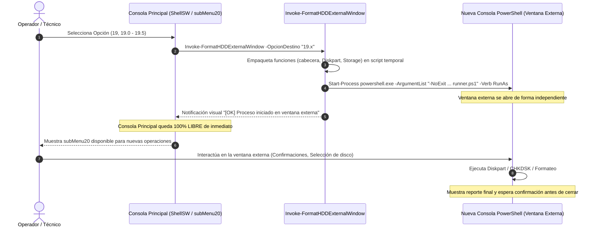

# DOCUMENTO DE ESPECIFICACIÓN TÉCNICA Y PLAN DE ACCIONES
## Módulo: `src/subMenu20.ps1` - Desacoplamiento Asíncrono Multiventana del Grupo 19
**Proyecto:** ShellSW - Soft. Administración y Gestión del Sistema Operativo  
**Autoría del Proyecto:** Ing. Wilson Yucra - spWil  
**Módulo Objetivo:** `e:\shellWil\src\subMenu20.ps1`  
**Grupo Objetivo:** Opción 19: *Todo sobre format HDD y SDD (Preparación de Discos y USB)*  
**Fecha de Elaboración:** Septiembre 2026  
**Versión Documental:** 1.0.0  

---

## 1. RESUMEN EJECUTIVO Y OBJETIVO

### 1.1 Objetivo General
Diseñar e implementar las modificaciones de código y acciones técnicas requeridas en el módulo [`subMenu20.ps1`](file:///e:/shellWil/src/subMenu20.ps1) de **ShellSW**, de manera que todas las opciones pertenecientes al **Grupo 19** ("*Todo sobre format HDD y SDD (Preparación de Discos y USB)*") se ejecuten de manera desacoplada en una **ventana o consola independiente de PowerShell**, garantizando que la **consola principal quede inmediatamente liberada y disponible** para que el operador de sistemas continúe realizando diagnósticos, mantenimiento o tareas remotas sin interrupciones ni bloqueos.

### 1.2 Alcance del Grupo 19
El grupo de preparación de discos y almacenamiento abarca tanto el submenú contenedor como las opciones directas:
* **Opción 19:** Submenú interactivo `psSubMenuFormatHDD` (Consola de preparación integral).
* **Opción 19.0:** Matriz de relación Filesystem vs Partición vs Modo Arranque BIOS/UEFI (`Show-FormatBootMatrix`).
* **Opción 19.1:** Ficha técnica y diagnósticos de salud S.M.A.R.T. (`Show-DiskTechnicalDetails`).
* **Opción 19.2:** Verificación de sectores y superficie con CHKDSK / Repair-Volume (`Invoke-DiskSurfaceCheck`).
* **Opción 19.3:** Formateo e inicialización en MBR (FAT32/NTFS) con partición Activa (`Format-DiskStorageMBR`).
* **Opción 19.4:** Formateo e inicialización en GPT (FAT32/NTFS) para UEFI (`Format-DiskStorageGPT`).
* **Opción 19.5:** Formateo e inicialización en exFAT Rápido/Profundo (`Format-DiskStorageExFAT`).

---

## 2. DIAGNÓSTICO TÉCNICO Y JUSTIFICACIÓN DEL CAMBIO

### 2.1 Estado Actual (Comportamiento Síncrono Bloqueante)
En la implementación vigente de [`subMenu20.ps1`](file:///e:/shellWil/src/subMenu20.ps1):
1. **Llamadas dentro del mismo hilo:** En el bloque `switch ($op)` (líneas 1625 a 1646), las opciones `"19"`, `"19.0"`, `"19.1"`, `"19.2"`, `"19.3"`, `"19.4"` y `"19.5"` invocan directamente las funciones en el mismo proceso de PowerShell de la consola activa.
2. **Operaciones de Larga Duración:** 
   * La verificación profunda de sectores (19.2 con `chkdsk.exe /f /r /x`) y los formateos profundos (19.3, 19.4 y 19.5 sin parámetro `quick` que escriben ceros en toda la superficie física) pueden tardar desde 20 minutos hasta varias horas en discos mecánicos o unidades USB de gran capacidad.
3. **Inmovilización del Técnico:** Mientras estas tareas de disco se ejecutan, el técnico queda totalmente imposibilitado de utilizar las demás utilidades de ShellSW (como revisión de RAM, escaneo DISM, gestión de Active Directory, auditoría de red o soporte remoto en `subMenu25`).
4. **Vulnerabilidad ante Cancelaciones Involuntarias:** Si el usuario presiona `Ctrl + C` intentando cancelar una visualización o volver al menú principal, puede abortar a mitad de ejecución una directiva de particionado de `diskpart`, dejando la unidad externa con particiones RAW, desmontada o en estado inconsistente.

### 2.2 Beneficios de la Solución Multiventana
* **Concurrencia Operativa:** El técnico lanza el formateo o diagnóstico de disco y la consola principal retorna de inmediato al menú de opciones, lista para otra tarea.
* **Aislamiento de Procesos:** La sesión secundaria de PowerShell gestiona su propio ciclo de vida, buffers de salida y códigos de salida (`$LASTEXITCODE`), protegiendo la sesión principal de fugas de memoria o bloqueos de I/O.
* **Persistencia de Resultados:** La ventana externa se configura con el parámetro `-NoExit` o con pausas explícitas (`Read-Host`), permitiendo que el reporte final de particionado o de CHKDSK quede visible en pantalla mientras el operador trabaja en otro monitor o ventana.
* **Elevación UAC Transparente:** Las operaciones sobre discos físicos requieren privilegios de Administrador. El lanzador puede forzar la elevación mediante `-Verb RunAs` si fuese necesario, asegurando éxito en `diskpart.exe` y `chkdsk.exe`.

---

## 3. ARQUITECTURA DE LA SOLUCIÓN MULTIVENTANA

### 3.1 Diagrama de Flujo del Desacoplamiento



### 3.2 Estrategia de Empaquetado y Ejecución del Runner Temporal
Dado que **ShellSW** se compila a un archivo único portable (`ShellSW.bat`) a través de [`build.ps1`](file:///e:/shellWil/build.ps1), la solución **no debe depender de rutas fijas relativas en disco que puedan no existir** cuando el script se distribuya en una máquina de cliente.

La estrategia óptima consiste en implementar una función orquestadora:
`Invoke-FormatHDDExternalWindow` dentro de [`subMenu20.ps1`](file:///e:/shellWil/src/subMenu20.ps1). Esta función:
1. Recibe la opción solicitada (`$OpcionDestino`).
2. Genera dinámicamente un archivo script temporal en `$env:TEMP` (por ejemplo: `$env:TEMP\shellWil_FormatHDD_<opcion>_<id>.ps1`).
3. Inyecta en el script las funciones críticas requeridas:
   * Funciones de presentación: `cabecera`, `Write-Header`.
   * Funciones auxiliares de disco: `Get-SafeDiskList`, `Invoke-DiskpartBatch`.
   * Funciones operativas: `Show-FormatBootMatrix`, `Show-DiskTechnicalDetails`, `Invoke-DiskSurfaceCheck`, `Format-DiskStorageMBR`, `Format-DiskStorageGPT`, `Format-DiskStorageExFAT`, y `psSubMenuFormatHDD`.
4. Añade el bloque de disparo según `$OpcionDestino`.
5. Ajusta el título de la nueva ventana (`$Host.UI.RawUI.WindowTitle`), colores de advertencia y codificación UTF-8.
6. Invoca el proceso mediante `Start-Process powershell.exe` con `-NoExit` y `-Verb RunAs`.
7. Presenta en la consola principal un cuadro informativo de confirmación y retorna inmediatamente.

---

## 4. ESPECIFICACIÓN DETALLADA DE MODIFICACIONES EN EL CÓDIGO

Todas las modificaciones se realizan de forma quirúrgica en el archivo [`src/subMenu20.ps1`](file:///e:/shellWil/src/subMenu20.ps1).

### 4.1 Modificación 1: Incorporación de la Función Despachadora `Invoke-FormatHDDExternalWindow`
**Ubicación sugerida:** Inmediatamente después de `function psSubMenuFormatHDD` (alrededor de la línea 785) y antes de `function psSubMenu20`.

```powershell
# =========================================================================================
# ORQUESTADOR DE EJECUCION EXTERNA PARA EL GRUPO 19 (DESACOPLAMIENTO MULTIVENTANA)
# =========================================================================================

function Invoke-FormatHDDExternalWindow {
    <#
    .SYNOPSIS
        Despacha la ejecución de las funciones del Grupo 19 (Formateo y Preparación de Discos/USB)
        a un proceso y ventana de consola independiente de PowerShell, liberando inmediatamente la
        consola principal para el operador.
    .PARAMETER OpcionDestino
        Código de la opción a ejecutar ("19", "19.0", "19.1", "19.2", "19.3", "19.4", "19.5").
    #>
    param(
        [Parameter(Mandatory=$true)]
        [string]$OpcionDestino
    )

    $taskMap = @{
        "19"   = @{ Titulo = "Submenu 19: Formateo HDD, SSD y USB (Preparacion S.O.)"; Cmd = "psSubMenuFormatHDD" }
        "19.0" = @{ Titulo = "19.0 Matriz Filesystem vs Particion vs Modo Arranque"; Cmd = "Show-FormatBootMatrix" }
        "19.1" = @{ Titulo = "19.1 Ficha Tecnica Detallada y Salud S.M.A.R.T.";     Cmd = "Show-DiskTechnicalDetails" }
        "19.2" = @{ Titulo = "19.2 Verificacion de Sectores y Revision Superficie";  Cmd = "Invoke-DiskSurfaceCheck" }
        "19.3" = @{ Titulo = "19.3 Formateo e Inicializacion en MBR (Particion ACTIVA)"; Cmd = "Format-DiskStorageMBR" }
        "19.4" = @{ Titulo = "19.4 Formateo e Inicializacion en GPT (UEFI Nativo)";  Cmd = "Format-DiskStorageGPT" }
        "19.5" = @{ Titulo = "19.5 Formateo e Inicializacion en exFAT (Multiplataforma)"; Cmd = "Format-DiskStorageExFAT" }
    }

    if (-not $taskMap.ContainsKey($OpcionDestino)) {
        Write-Host "[ERROR] Opcion de formateo '$OpcionDestino' no reconocida para ejecucion externa." -ForegroundColor Red
        return
    }

    $info = $taskMap[$OpcionDestino]
    $tempFile = Join-Path $env:TEMP ("shellWil_FormatHDD_" + $OpcionDestino.Replace(".", "_") + "_" + (Get-Random -Minimum 1000 -Maximum 9999) + ".ps1")

    # Lista de funciones del módulo que deben exportarse al subproceso
    $requiredFunctions = @(
        'cabecera',
        'Write-Header',
        'Get-SafeDiskList',
        'Invoke-DiskpartBatch',
        'Show-FormatBootMatrix',
        'Show-DiskTechnicalDetails',
        'Invoke-DiskSurfaceCheck',
        'Format-DiskStorageMBR',
        'Format-DiskStorageGPT',
        'Format-DiskStorageExFAT',
        'psSubMenuFormatHDD'
    )

    # Construcción compatible con PowerShell 2.0 / 3.0 / 5.1 / 7+
    $sb = New-Object System.Text.StringBuilder

    [void]$sb.AppendLine("# ==========================================================================")
    [void]$sb.AppendLine("# CONSOLA SECUNDARIA AUTONOMA - SHELLSW (DISCOS Y PREPARACION S.O.)")
    [void]$sb.AppendLine("# Tarea: $($info.Titulo)")
    [void]$sb.AppendLine("# Generado: $(Get-Date -Format 'yyyy-MM-dd HH:mm:ss')")
    [void]$sb.AppendLine("# ==========================================================================")
    [void]$sb.AppendLine("try { `$Host.UI.RawUI.WindowTitle = 'ShellSW - Discos y Formateo [$OpcionDestino]' } catch {}")
    [void]$sb.AppendLine("[Console]::OutputEncoding = [System.Text.Encoding]::UTF8")
    [void]$sb.AppendLine("")

    # Definiciones de contingencia para cabeceras si no estuviesen cargadas en el entorno
    if (-not (Get-Command 'cabecera' -ErrorAction SilentlyContinue)) {
        [void]$sb.AppendLine(@'
function cabecera {
    Write-Host " ------------------------------------------------------------------------" -ForegroundColor Cyan
    Write-Host " Ing. Wilson Yucra - Soft. Administracion y Gestion del Sistema Operativo" -ForegroundColor Cyan
    Write-Host " ------------------------------------------------------------------------" -ForegroundColor Cyan
}
'@)
    }

    if (-not (Get-Command 'Write-Header' -ErrorAction SilentlyContinue)) {
        [void]$sb.AppendLine(@'
function Write-Header {
    param([string]$texto)
    $ancho = $texto.Length + 15
    $linea = "=" * $ancho
    Write-Host "`n$linea" -ForegroundColor Yellow
    Write-Host "| $texto |" -ForegroundColor White -BackgroundColor DarkBlue
    Write-Host "$linea" -ForegroundColor Yellow
}
'@)
    }

    # Serializar las funciones activas en memoria hacia el archivo runner
    foreach ($fn in $requiredFunctions) {
        $cmd = Get-Command $fn -ErrorAction SilentlyContinue
        if ($cmd) {
            [void]$sb.AppendLine("function $fn {")
            [void]$sb.AppendLine($cmd.Definition)
            [void]$sb.AppendLine("}`n")
        }
    }

    # Bloque de ejecución principal del subproceso
    [void]$sb.AppendLine("# --- EJECUCION DE LA TAREA SOLICITADA ---")
    [void]$sb.AppendLine("try {")
    [void]$sb.AppendLine("    $($info.Cmd)")
    [void]$sb.AppendLine("}")
    [void]$sb.AppendLine("catch {")
    [void]$sb.AppendLine("    Write-Host '`n[ERROR CRITICO EN VENTANA SECUNDARIA]: ' `$_.Exception.Message -ForegroundColor Red")
    [void]$sb.AppendLine("}")
    [void]$sb.AppendLine("finally {")
    [void]$sb.AppendLine("    Write-Host '`n==========================================================================' -ForegroundColor Cyan")
    [void]$sb.AppendLine("    Write-Host ' [PROCESO FINALIZADO] Esta ventana permanecera abierta para su consulta.' -ForegroundColor Green")
    [void]$sb.AppendLine("    Write-Host ' Puede revisar los reportes y cerrarla cuando lo desee.' -ForegroundColor Gray")
    [void]$sb.AppendLine("    Write-Host '==========================================================================' -ForegroundColor Cyan")
    [void]$sb.AppendLine("    Write-Host ''")
    [void]$sb.AppendLine("    Read-Host 'Presione ENTER para cerrar esta ventana...'")
    [void]$sb.AppendLine("    try { Remove-Item -Path `$MyInvocation.MyCommand.Path -Force -ErrorAction SilentlyContinue } catch {}")
    [void]$sb.AppendLine("}")

    # Guardar en temporal con codificación UTF-8
    [System.IO.File]::WriteAllText($tempFile, $sb.ToString(), [System.Text.Encoding]::UTF8)

    # Lanzamiento del proceso de PowerShell en ventana externa independiente con elevación UAC
    $procArgs = @(
        "-NoExit",
        "-ExecutionPolicy", "Bypass",
        "-File", "`"$tempFile`""
    )

    try {
        Start-Process -FilePath "powershell.exe" -ArgumentList $procArgs -Verb RunAs -ErrorAction Stop
    }
    catch {
        # Si el usuario deniega UAC o el entorno no soporta RunAs, lanzar sin elevación forzada
        Start-Process -FilePath "powershell.exe" -ArgumentList $procArgs -ErrorAction SilentlyContinue
    }

    # Panel informativo en la consola principal
    Write-Host "`n==========================================================================" -ForegroundColor Cyan
    Write-Host "  [OK] TAREA DESPLEGADA EN UNA VENTANA O CONSOLA INDEPENDIENTE" -ForegroundColor Green
    Write-Host "==========================================================================" -ForegroundColor Cyan
    Write-Host "  Accion Solicitada : $($info.Titulo)" -ForegroundColor White
    Write-Host "  Opcion / Codigo   : $OpcionDestino" -ForegroundColor Yellow
    Write-Host "  Estado Operativo  : Se ha abierto una consola secundaria de PowerShell." -ForegroundColor Gray
    Write-Host "  Disponibilidad    : Esta consola principal queda 100% LIBRE para su uso" -ForegroundColor Green
    Write-Host "                      inmediato en otras tareas del sistema." -ForegroundColor Gray
    Write-Host "==========================================================================" -ForegroundColor Cyan
    Write-Host ""
}
```

---

### 4.2 Modificación 2: Actualización de la Cartelera de Opciones en `psSubMenu20`
**Ubicación:** Líneas 818 a 824 de [`src/subMenu20.ps1`](file:///e:/shellWil/src/subMenu20.ps1).

Se actualizan las leyendas en la consola para que el usuario conozca visualmente que estas operaciones se abren en ventanas independientes:

```diff
-            Write-Host "19. Todo sobre format HDD y SDD (Preparar Disco o USB)" -ForegroundColor Cyan
-            Write-Host "  19.0 Tabla de relacion: Filesystem vs Particion vs Modo Arranque" -ForegroundColor Yellow
-            Write-Host "  19.1 Informacion tecnica detallada de la unidad (Particion, FS, Salud SMART)" -ForegroundColor Yellow
-            Write-Host "  19.2 Verificacion de sectores y revision de superficie (Superficial vs Profunda)" -ForegroundColor Yellow
-            Write-Host "  19.3 Formateo e inicializacion en MBR (FAT32/NTFS) para SO Windows - Particion ACTIVA" -ForegroundColor Yellow
-            Write-Host "  19.4 Formateo e inicializacion en GPT (FAT32/NTFS) para SO Windows UEFI - Particion Lista" -ForegroundColor Yellow
-            Write-Host "  19.5 Formateo e inicializacion en exFAT (Rapido vs Profundo) - Particion Lista" -ForegroundColor Yellow
+            Write-Host "19. Todo sobre format HDD y SDD (Preparar Disco o USB) [VENTANA EXTERNA]" -ForegroundColor Cyan
+            Write-Host "  19.0 Tabla de relacion: Filesystem vs Particion vs Modo Arranque [VENTANA EXTERNA]" -ForegroundColor Yellow
+            Write-Host "  19.1 Informacion tecnica detallada de la unidad (Particion, FS, Salud SMART) [VENTANA EXTERNA]" -ForegroundColor Yellow
+            Write-Host "  19.2 Verificacion de sectores y revision de superficie (Superficial vs Profunda) [VENTANA EXTERNA]" -ForegroundColor Yellow
+            Write-Host "  19.3 Formateo e inicializacion en MBR (FAT32/NTFS) para SO Windows - Particion ACTIVA [VENTANA EXTERNA]" -ForegroundColor Yellow
+            Write-Host "  19.4 Formateo e inicializacion en GPT (FAT32/NTFS) para SO Windows UEFI - Particion Lista [VENTANA EXTERNA]" -ForegroundColor Yellow
+            Write-Host "  19.5 Formateo e inicializacion en exFAT (Rapido vs Profundo) - Particion Lista [VENTANA EXTERNA]" -ForegroundColor Yellow
```

---

### 4.3 Modificación 3: Redirección del Bloque `switch ($op)` en `psSubMenu20`
**Ubicación:** Líneas 1625 a 1646 de [`src/subMenu20.ps1`](file:///e:/shellWil/src/subMenu20.ps1).

Se reemplazan las llamadas síncronas bloqueantes por el despacho mediante `Invoke-FormatHDDExternalWindow`:

```diff
                 "19" { 
-                    psSubMenuFormatHDD
+                    Invoke-FormatHDDExternalWindow -OpcionDestino "19"
                 }
                 "19.0" { 
-                    Show-FormatBootMatrix
+                    Invoke-FormatHDDExternalWindow -OpcionDestino "19.0"
                 }
                 "19.1" { 
-                    Show-DiskTechnicalDetails
+                    Invoke-FormatHDDExternalWindow -OpcionDestino "19.1"
                 }
                 "19.2" { 
-                    Invoke-DiskSurfaceCheck
+                    Invoke-FormatHDDExternalWindow -OpcionDestino "19.2"
                 }
                 "19.3" { 
-                    Format-DiskStorageMBR
+                    Invoke-FormatHDDExternalWindow -OpcionDestino "19.3"
                 }
                 "19.4" { 
-                    Format-DiskStorageGPT
+                    Invoke-FormatHDDExternalWindow -OpcionDestino "19.4"
                 }
                 "19.5" { 
-                    Format-DiskStorageExFAT
+                    Invoke-FormatHDDExternalWindow -OpcionDestino "19.5"
                 }
```

---

### 4.4 Modificación 4: Comportamiento del Submenú `psSubMenuFormatHDD` en la Ventana Externa
Dentro de la función `psSubMenuFormatHDD` (línea 752), cuando el usuario decide abrir la opción `"19"` completa, dicha función se ejecuta íntegramente dentro de la ventana secundaria.  
En esa ventana secundaria, las opciones `"19.0"` a `"19.5"` se ejecutan de forma local y secuencial sin requerir abrir terceras ventanas, permitiendo al operador trabajar cómodamente en la ventana de formateo hasta seleccionar `"0"` (Salir), momento en el cual la ventana secundaria se cierra limpiamente tras confirmar con ENTER.

---

## 5. PLAN DE ACCIONES Y PROCEDIMIENTO DE APLICACIÓN PASO A PASO

Para aplicar con éxito estas modificaciones en el repositorio `e:\shellWil`, se debe seguir rigurosamente el siguiente plan de acciones:

### Fase 1: Creación de Respaldo de Seguridad
Antes de alterar el código fuente, generar una copia de respaldo de `subMenu20.ps1`:
```powershell
Copy-Item "e:\shellWil\src\subMenu20.ps1" "e:\shellWil\src\subMenu20.ps1.bak" -Force
```

### Fase 2: Implementación de Código en `src/subMenu20.ps1`
1. Abrir [`src/subMenu20.ps1`](file:///e:/shellWil/src/subMenu20.ps1).
2. Insertar la función `Invoke-FormatHDDExternalWindow` justo arriba de `function psSubMenu20` (aproximadamente en la línea 786).
3. Modificar el menú visual de `psSubMenu20` (líneas 818-824) agregando el sufijo `[VENTANA EXTERNA]`.
4. Modificar el bloque `switch ($op)` en `psSubMenu20` (líneas 1625-1646) redirigiendo cada caso del grupo 19 a `Invoke-FormatHDDExternalWindow -OpcionDestino "<opcion>"`.
5. Guardar el archivo en codificación **UTF-8 sin BOM**.

### Fase 3: Recompilación y Ensamblado de `ShellSW.bat`
Dado que `ShellSW.bat` es el ejecutable monolítico generado a partir de los módulos de `src/`, se debe ejecutar el compilador interno:
```powershell
Set-Location "e:\shellWil"
.\build.ps1
```
*Criterio de éxito:* El script debe mostrar:
`[EXITO] ShellSW.bat compilado exitosamente en UTF-8 sin BOM.`

### Fase 4: Protocolo de Pruebas y Validación (Matriz de Casos de Prueba)

| Caso de Prueba | Acción Realizada | Comportamiento Esperado | Resultado |
| :--- | :--- | :--- | :--- |
| **CP-01** | Seleccionar opción `19` desde Submenú 20 | Se abre una nueva consola con título `ShellSW - Discos y Formateo [19]` mostrando el submenú de discos. La consola principal muestra el banner de confirmación y retorna de inmediato al menú. | Validar |
| **CP-02** | Seleccionar opción `19.0` desde Submenú 20 | Se abre una nueva ventana mostrando la matriz Filesystem vs BIOS/UEFI. La consola principal queda libre. | Validar |
| **CP-03** | Seleccionar opción `19.1` y listar discos | La ventana secundaria muestra la ficha técnica SMART y particiones del disco seleccionado. La consola principal puede ejecutar consultas de RAM (Opción 1) en paralelo sin conflicto. | Validar |
| **CP-04** | Seleccionar opción `19.2` (Superficie / CHKDSK) | La ventana secundaria inicia el análisis de superficie. La consola principal continúa totalmente interactiva mientras CHKDSK corre en la otra pantalla. | Validar |
| **CP-05** | Formateo MBR / GPT / exFAT (19.3, 19.4, 19.5) | La ventana secundaria solicita confirmaciones de seguridad (`CONFIRMAR`), ejecuta `diskpart` y muestra el resultado sin bloquear la consola principal. | Validar |
| **CP-06** | Cierre y Limpieza de Temporales | Al presionar ENTER al finalizar la tarea en la ventana secundaria, la ventana se cierra y el archivo `.ps1` en `$env:TEMP` se autoelimina. | Validar |

---

## 6. CONSIDERACIONES DE SEGURIDAD, CONCURRENCIA Y COMPATIBILIDAD

1. **Prevención de Condiciones de Carrera sobre el Mismo Disco:**
   * Las funciones del Grupo 19 (`Format-DiskStorageMBR`, `Format-DiskStorageGPT`, `Format-DiskStorageExFAT`) cuentan con validaciones nativas de protección (`IsSystem` para impedir tocar el disco del sistema operativo `C:`).
   * Al estar en ventanas separadas, se recomienda que el operador no lance dos formateos simultáneos apuntando al *mismo número de disco físico*.
2. **Ciclo de Vida de los Archivos Temporales:**
   * La rutina en el bloque `finally` del script secundario ejecuta:
     `try { Remove-Item -Path $MyInvocation.MyCommand.Path -Force } catch {}`
     lo que asegura que no queden residuos de scripts temporales en el directorio `$env:TEMP`.
3. **Compatibilidad con Versiones de Windows y PowerShell:**
   * La función utiliza `New-Object System.Text.StringBuilder` y llamadas estándar de `Start-Process`, siendo 100% compatible con **Windows 7 SP1**, **Windows 8.1**, **Windows 10**, **Windows 11** y **Windows Server 2008 R2 - 2025**.
   * El parámetro `-ExecutionPolicy Bypass` garantiza que la ventana secundaria se abra sin bloqueos de directiva de ejecución restrictivas en entornos corporativos.

---
*Documento preparado conforme a los lineamientos arquitectónicos y estándares de ShellSW.*
